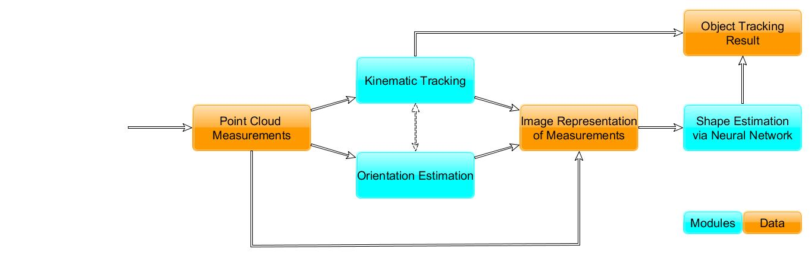

# 'NN-ETT': CNN-based Extended Target Tracking 

Extended Target Tracking utilizing Convolutional Neural Networks for extent estimation.

This repository contains code implementing the FUSION22 Paper 
```
"CNN-based Shape Estimation for Extended Object Tracking using Point Cloud Measurements"
Simon Steuernagel, Kolja Thormann, and Marcus Baum
```



The three submodules can be freely exchanged. For example, a more elaborate (Extended) Kalman Filter could be 
implemented (e.g. in order to take into account a specific motion model), without impacting the implementation of the
Shape Estimator. 

The general functionality of the NN-ETT tracking architecture remains that of a sequentially updated filter.

## This Repository

In this repository, all relevant code for the implementation of the NN-ETT tracker for single elliptical extended
objects is implemented.

This includes trained weights for the Shape Estimation CNN, to be [found here](./models/MultiChannelEllipticalNN/v1.ckpt). 
The corresponding network implementation can be found [here](./src/models/multi_channel_elliptical_nn.py).

All other code can be found directly in the [`/src` folder](./src). To re-create the experiments presented in the paper,
the file [`evaluation_plot_generation.py`](./src/evaluation_plot_generation.py) can be executed.

The implementation of the full NN-ETT tracking architecture (using the previously described CNN) can be found in the 
file [`nn_ett_tracker.py`](./src/nn_ett_tracker.py). Two implementations of reference algorithms, namely 
[IAE](./src/iae.py) and [MEM-EKF*](./src/memekf.py) are included as well.

Finally, all other files in [`/src`](./src) contain the remaining code used for data generation, visualization and 
general utility functions.